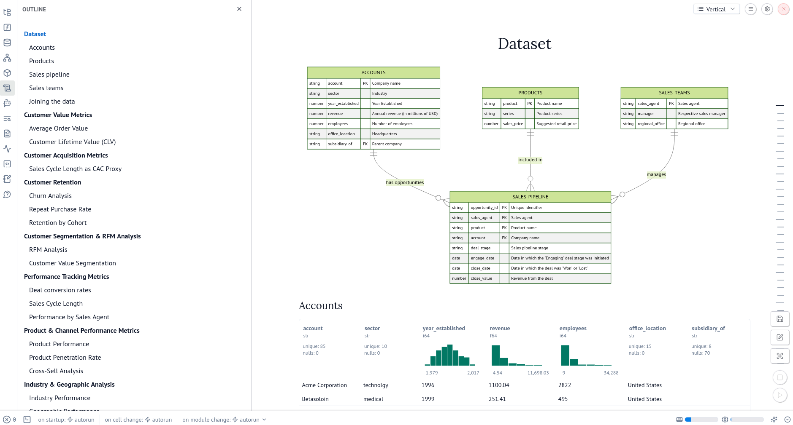
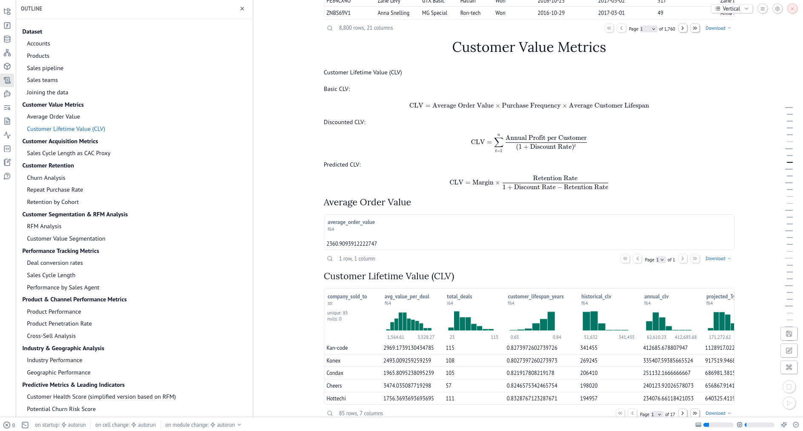
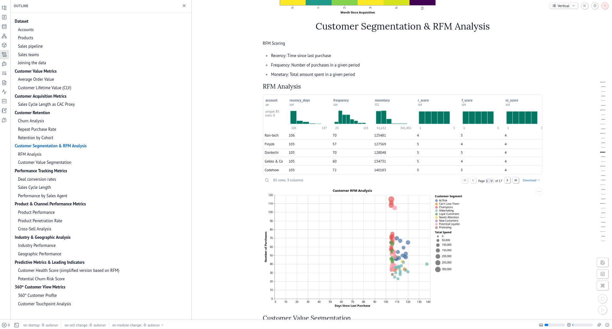

# CRM Data Analysis

This project performs analysis on CRM data using a Marimo notebook. It leverages DuckDB for data processing and includes components for data visualization and machine learning tasks like clustering.

## Data

The analysis uses data stored in CSV files within the `public/` directory:
- `accounts.csv`
- `products.csv`
- `sales_pipeline.csv`
- `sales_teams.csv`

An Entity-Relationship Diagram (ERD) describing the data structure can be found within the main Marimo notebook (`crm.py`).

## Setup

This project uses `uv` for dependency management.

1.  **Install uv:** If you haven't already, install uv:
    ```bash
    pip install uv
    ```
2.  **Create a virtual environment (optional but recommended):**
    ```bash
    python -m venv .venv
    source .venv/bin/activate # On Windows use `.venv\Scripts\activate`
    ```
3.  **Sync dependencies:**
    ```bash
    uv sync
    ```

## Usage

The primary analysis is performed within the Marimo notebook.

1.  **Run the Marimo notebook:**
    ```bash
    marimo edit crm.py
    ```
    This will start the Marimo server and open the notebook editor in your web browser.

The project also includes a script for machine learning:
- `crm_clustering.py`: Performs K-means clustering analysis using Scikit-learn.

## Screenshots

Here are some glimpses of the Marimo notebook interface and visualizations:


*Dataset Preview*


*Markdown formulas*


*Interactive graphs*

## Technologies Used

- [Marimo](https://marimo.io/) for the interactive notebook interface.
- [DuckDB](https://duckdb.org/) for efficient data processing and SQL querying.
- [Pandas](https://pandas.pydata.org/) for data manipulation.
- [Altair](https://altair-viz.github.io/) for declarative statistical visualization.
- [Scikit-learn](https://scikit-learn.org/) for K-means clustering.
